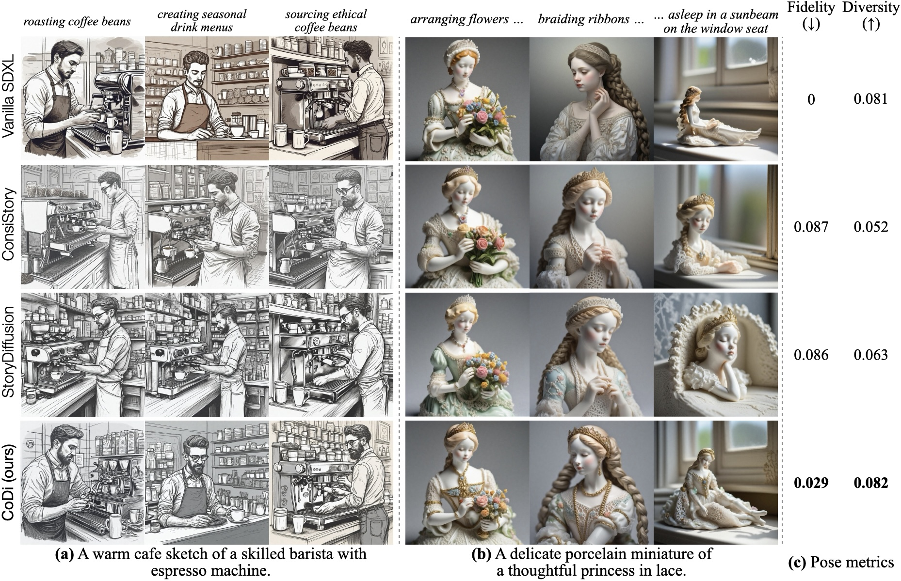
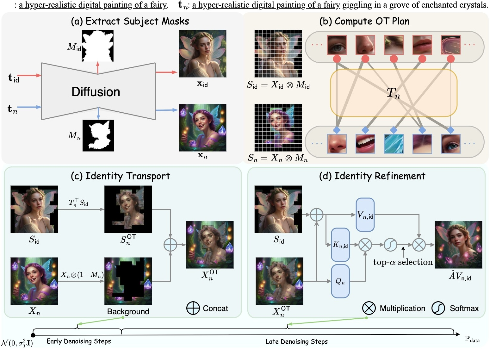
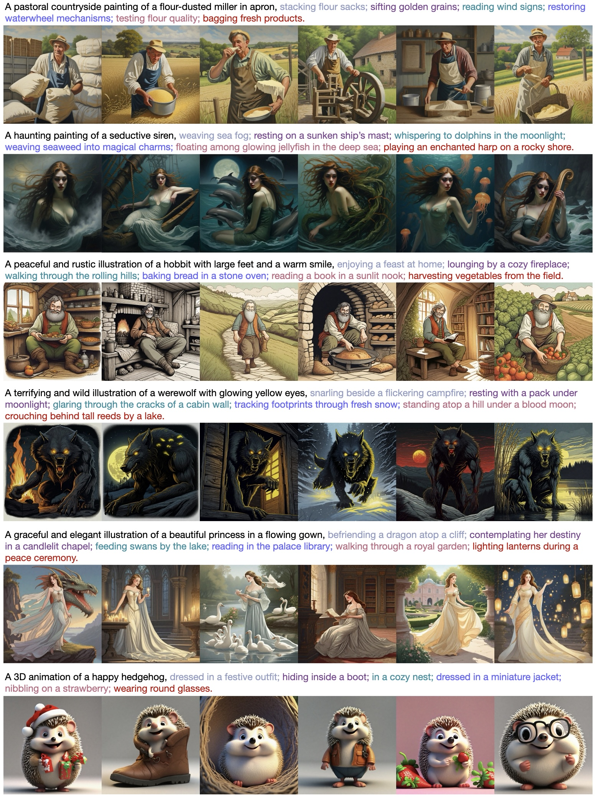
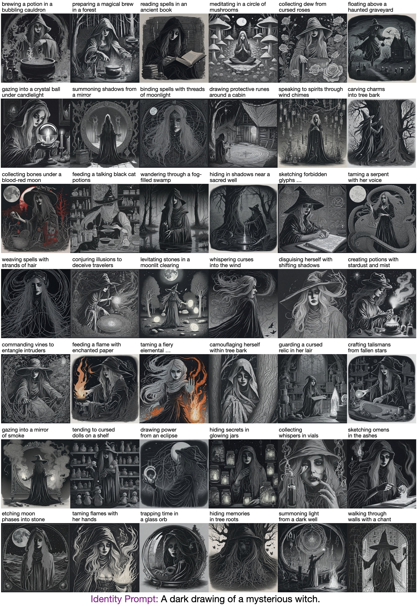

<h1 align="center">
  CoDi:Subject-Consistent and Pose-Diverse Text-to-Image Generation
  <br>
</h1>

<div align="center">

<a href="https://arxiv.org/abs/2501.13554" style="display: inline-block;">
    
</a>&nbsp;

<!-- <a href="https://byliutao.github.io/1Prompt1Story.github.io/" style="display: inline-block;">
    
</a>&nbsp; -->

</div>

<p align="center">
  <a href="#model-architecture">Model Architecture</a> •
  <a href="#how-to-use">How To Use</a> •
  <a href="#citation">Citation</a> •
  <a href="#acknowledgement">Acknowledgement</a> •
  <a href="#visualization">Visualization</a> 
</p>

[](./teaser/teaser.jpeg)

## Model Architecture
[](./teaser/architecture.jpg)

## How To Use

```bash
# Clone this repository
$ git clone https://github.com/NJU-PCALab/CoDi

# Go into the repository
$ cd CoDi

### Install dependencies ###
$ conda env create --file environment.yml
$ conda activate codi
### Install dependencies ENDs ###

# Run infer code
$ python main.py

# Run benchmark generation code
$ python gen_benchmark.py
```

## Citation
If our work assists your research, feel free to give us a star ⭐ or cite us using:
```
@inproceedings{
liu2025onepromptonestory,
title={One-Prompt-One-Story: Free-Lunch Consistent Text-to-Image Generation Using a Single Prompt},
author={Tao Liu and Kai Wang and Senmao Li and Joost van de Weijer and Fhad Khan and Shiqi Yang and Yaxing Wang and Jian Yang and Mingming Cheng},
booktitle={The Thirteenth International Conference on Learning Representations},
year={2025},
url={https://openreview.net/forum?id=cD1kl2QKv1}
}
```

## Acknowledgement

We gratefully acknowledge the following repositories for providing useful components and functions that contributed to our work.

- [ConsiStory](https://github.com/NVlabs/consistory)
- [1Prompt1Story](https://github.com/byliutao/1Prompt1Story)

## Visualization

### Qualitative Results
  <figure style="display: inline-block; margin: 20px; text-align: center; max-width: 700px;">
    
  </figure>

### Long Story Image Generation
<div align="center">
  <figure style="display: inline-block; margin: 20px; text-align: center; max-width: 700px;">
    
  </figure>


